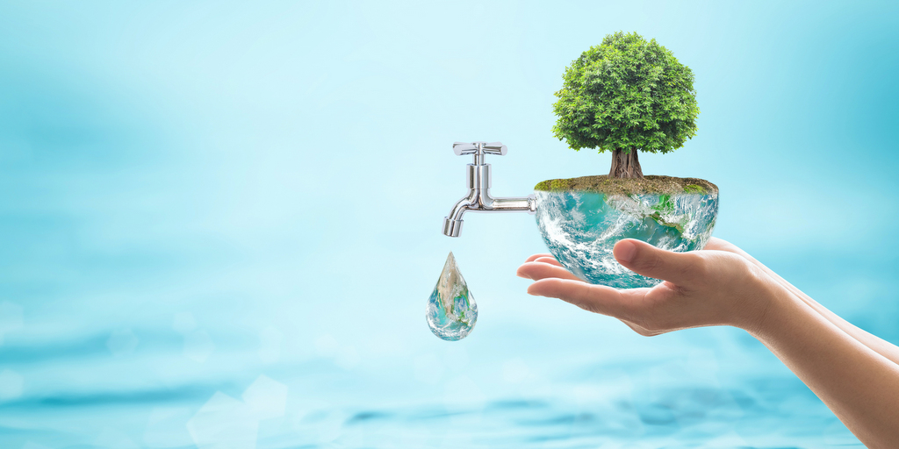

# Consumo-del-agua

## Tema : Consumo del agua
  < div align="center">
  

## Pregunta a responder con el analisis de datos:
¿En que momentos del dia se registra un mayor consumo de agua en los hogares?

## Elementos de datos necesarios:

- Registro de consumo de agua por hora \ dia en cada vivienda,
- Numero de habitantes por hogar, 
- Estaciones del año  (verano, invierno ) para identificar cambios en el uso de agua,
- Actividades principales que generan mayor consumo de agua(baño, cocina , lavado de ropa, etc.)

## Dataset
*[Conjunto de datos sobre el consumo mundial de agua (2000-2024) 🌍💧](consumo_global_de_agua_limpia.csv)
## Fuentes de informacion:
- https://www.fundacionaquae.org/como-utilizamos-el-agua-en-nuestras-casas/
- https://share.google/mHuxI0oyAiw2840h8
- https://share.google/y9JoeLOCU6qIGUXmF
- https://share.google/zC5KFvYKV11vYtMvc

## Objetivo:

Hacer conciencia sobre el desperdicio de agua y hacer su uso necesario para asi conservar este recurso y proteger el medio ambiente.
